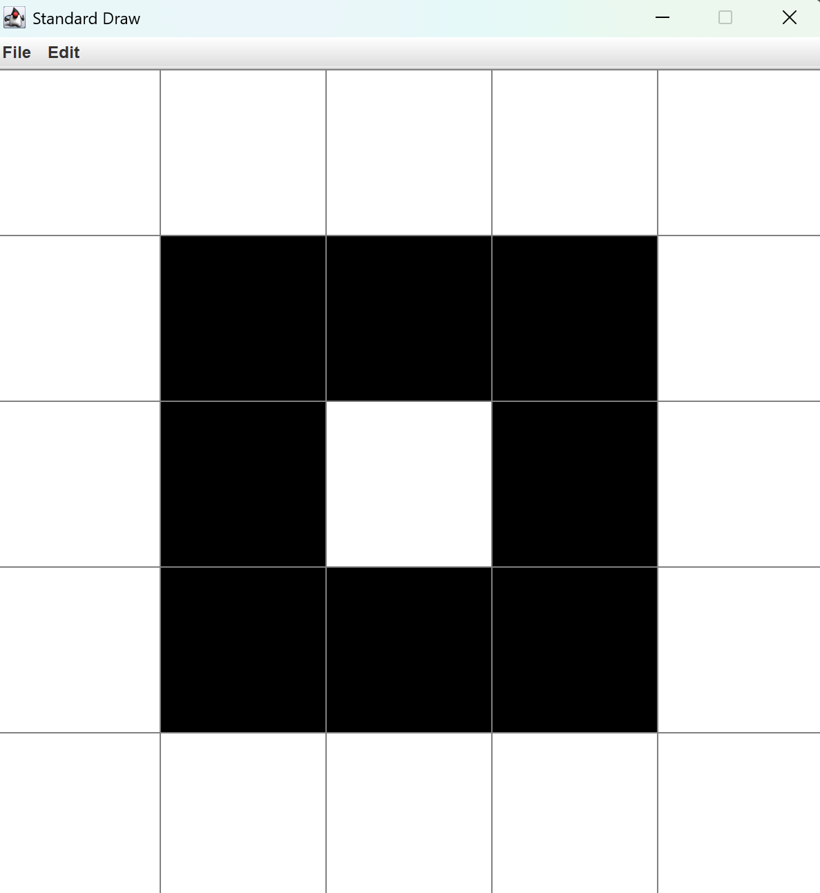
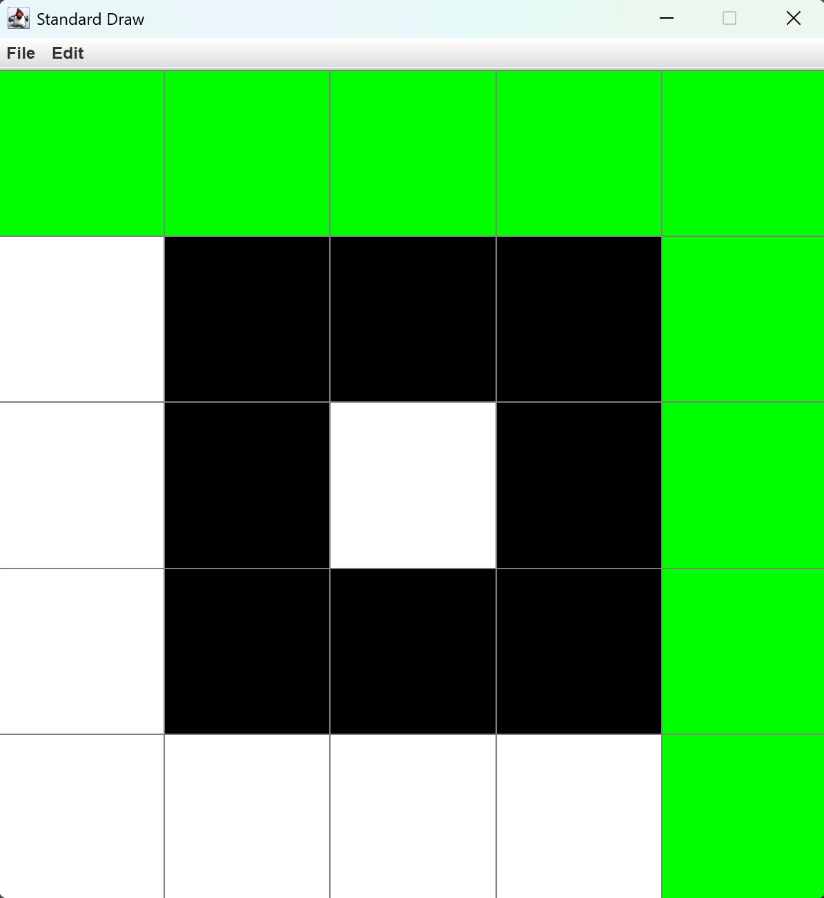

I2CS_Ex2
Introduction to Computer Science, Ariel University, 2026

Assignment overview
Implementation of a 2D integer map that represents an image or maze.
The project focuses on basic object oriented programming and on BFS based algorithms:
shortest path, all distances from a source, and flood fill.
The project includes a simple GUI for visualizing maps.

Project structure
src/Ex2/Pixel2D.java – interface for integer 2D coordinates
src/Ex2/Map2D.java – interface for a 2D integer map
src/Ex2/Index2D.java – implementation of Pixel2D
src/Ex2/Map.java – main implementation of Map2D and all algorithms
src/Ex2/Ex2_GUI.java – GUI and file utilities for Map2D using StdDraw
src/Ex2/StdDraw.java – drawing library from Intro2CS
src/Ex2/Index2DTest.java – JUnit tests for Index2D
src/Ex2/MapTest.java – JUnit tests for Map

Main features

Basic map operations
initialization from width, height and value
initialization from a 2D array with deep copy and validation
getters for width, height and pixel values
setters for single pixels by coordinates or by Pixel2D

Map editing operations
addMap2D – element wise sum when dimensions match
mul – multiply all entries by a scalar and cast to int
rescale – resize the map using nearest neighbor interpolation

Drawing operations
drawRect – fill axis aligned rectangle between two pixels with a given color
drawLine – draw a discrete line between two pixels
drawCircle – fill all pixels within a given radius around a center pixel

BFS based algorithms
fill – flood fill of the connected component of a starting pixel
supports cyclic and non cyclic maps, returns number of painted pixels
shortestPath – BFS based shortest path between two pixels while avoiding obstacles
supports cyclic and non cyclic maps, returns the path as an array
allDistance – BFS from a single source pixel
returns a new Map where each entry stores the shortest distance
non reachable entries are stored as -1

GUI and file format
Ex2_GUI uses StdDraw to display maps as a grid of squares.
Color 0 is drawn as white, 1 as black, other values as gray levels.

Input map file format (map.txt)
Each line represents a row in the map.
Values in a row are separated by a single space.
All rows have the same length.

Example map.txt

    0 0 0 0 0  
    0 1 1 1 0  
    0 1 0 1 0 
    0 1 1 1 0 
    0 0 0 0 0 

How to run the GUI

Place map.txt in the project root folder (same level as src).

Open Ex2_GUI in IntelliJ.

Run the main method of Ex2_GUI.

A StdDraw window displays the map.

Testing
The project uses JUnit tests.
Index2DTest verifies constructors, getters, distance and equals.
MapTest verifies initialization, equality, drawing operations, fill, shortestPath and allDistance.
All tests pass before submission.

For Example:

The image shows the shortest path from start (0,0) to  (4,4) avoiding the cells with value of 1:

